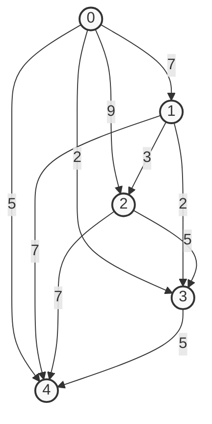
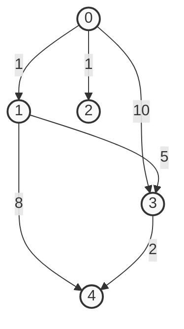
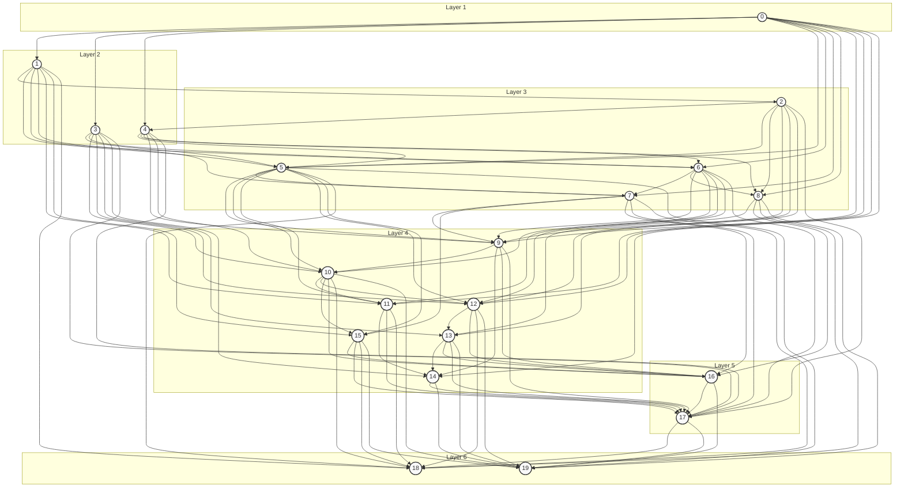
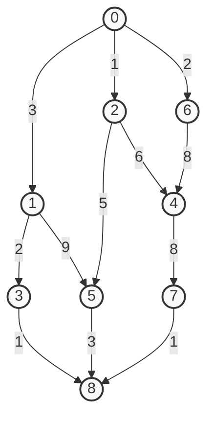

# Graphs

Code for code alongs.

* startCode - Contains code for starting the code alongs
* solutionCode - provides solution files for each code along


> [!IMPORTANT]
> The code along talks about a 10000sample file. This file
> was too large to store on github, so you will want to generate one yourself
> if you want to run the test. 

## Generating Sample Data

You can generate sample data by running the `dag-generate.py` script in the samples directory. 

Examples:

```console
$ ./dag-generate.py > 10Random.txt
```
```console
$ ./dag-generate.py --vertices 10000 > 10000Random.txt
```

To generate the help message and see the options
```console
$ ./dag-generate.py -h
```

> [!NOTE]  
> Windows clients will need to include `python` in front of the script so `python dag-generate.py > 10Random.txt`.
> Mac or Linux you may need to add the +x permission, or use `python3` in front
> of the script.
>
> For mac and linux, including the `#!/usr/bin/env python3` at the top
> of the file tells the shell what program it needs to execute the script.
> That is why the script can be treated as an executable. Without that
> you would always need the program `python3` in front. 


Here is mermaid for the various sample graphs provided:

### Five Node Sample



### Five Node Sparse Sample




### 20 Vertices, 94 edges - Randomly Generated



### Layered Sample
